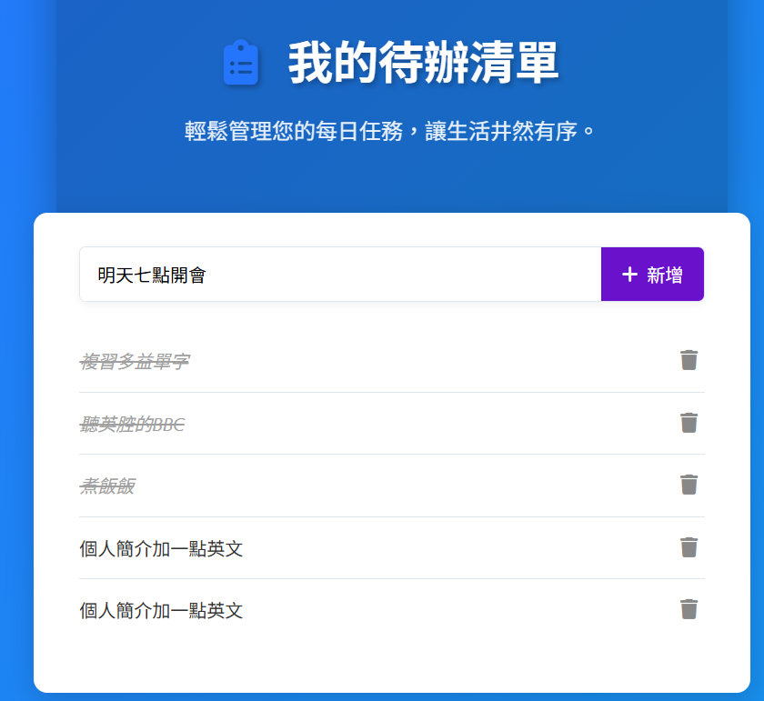

# 📚 <font color="#ff00ff">全端 ToDo-List API 實戰記錄手冊 </font>
### <font color="#00ffff">(Backend: Node.js + Express + hppt-server+ PostgreSQL + ORM )</font>
### <font color="#00ffff">(Frontend: 純Javascript＋純HTML＋純CSS)</font>

本手冊記錄了如何從零開始，建構一個具備 CRUD 功能、使用 Sequelize ORM 連接 PostgreSQL，並搭配純 JavaScript/HTML/CSS 前端介面的專業級待辦事項應用程式。

## <font color="orange">階段一：後端 API 基礎建構與資料庫連線</font>
<ol>

### <li>專案初始化與核心依賴安裝</li>
開啟終端機，建立並進入後端專案資料夾(simple-todo-api)。

|動作            |指令      |說明      |
|---------------|----------|----------|
|初始化專案|npm init -y|建立 package.json 檔案。|
|安裝核心依賴|npm install express pg cors joi|Express (框架)、pg (PostgreSQL 驅動)、cors (跨域)、joi (驗證)。
|安裝開發依賴|npm install --save-dev |nodemon dotenvNodemon (自動重啟伺服器)、dotenv (環境變數)。|
||||

###  <li>配置開發腳本 (package.json) </li>
打開 package.json，在 "scripts" 區塊中添加 dev 腳本，方便開發：
    
JSON

```
"scripts": {
    "test": "echo \"Error: no test specified\" && exit 1",
    "dev": "nodemon server.js", 
    "start": "node server.js"
}
```

###  <li>環境變數設置 </li>
    
<ul>

#### <li> A. 建立 .env 檔案 (位於專案根目錄)</li>   
 用於存放敏感資訊（如資料庫密碼）和配置，確保安全。

資料庫配置
```
DB_USER=postgres
DB_HOST=localhost
DB_NAME=todo_db
DB_PASSWORD=mypassword  # 替換成您的密碼
DB_PORT=5432
```
應用程式配置
```
PORT=3000
```
#### <li>B. 設置 PostgreSQL 資料庫
確保您的 PostgreSQL 服務已運行，並創建資料庫：

SQL
 ```
CREATE DATABASE todo_db;
 ```
</ul>

### <li>建立後端檔案結構: (*)手動建立, 其餘node.js會自動產生</li>

```
simple-todo-api/
├── node_modules/           // 自動建立
├── .env                    //*手動建立
├── package.json            // 自動建立
├── package-lock.json       // 自動建立
├── server.js               //*手動建立-伺服器入口
├── routes/                 //*手動建立
│   └── todo.routes.js      //*手動建立-路由定義
└── controllers/
    └── todo.controller.js  //*手動建立-業務邏輯 (CRUD 實作)
 ```
</ol>


## <font color="orange"> 階段二：後端優化與 ORM 升級 (Sequelize) </font>

此階段我們將替換原本手寫 SQL 的邏輯，使用更現代的 Sequelize ORM。
<ol>

### <li>安裝 Sequelize 依賴</li>
在 simple-todo-api 根目錄中執行：

Bash
```
npm install sequelize
```

### <li>建立 Sequelize 模型結構</li>
```
simple-todo-api/
└── models/               //*手動建立                              
    ├── index.js          //手動建立 -Sequelize 連線與配置
    └── Todo.model.js     //手動建立 Todo 表格模型定義
```

### <li>ORM 程式碼實作</li>

<ul>

#### <li>A. models/index.js (連線與同步)</li>

這個檔案負責建立 Sequelize 實例、連接資料庫，並載入所有模型。   
在 simple-todo-api 根目錄下建立 models 資料夾，然後建立 models/index.js：

simple-todo-api/models/index.js
    
```
// simple-todo-api/models/index.js

const { Sequelize } = require('sequelize');

// 從 .env 讀取配置
const dbUser = process.env.DB_USER;
const dbHost = process.env.DB_HOST;
const dbName = process.env.DB_NAME;
const dbPassword = process.env.DB_PASSWORD;
const dbPort = process.env.DB_PORT;

// 創建 Sequelize 實例
const sequelize = new Sequelize(dbName, dbUser, dbPassword, {
    host: dbHost,
    port: dbPort,
    dialect: 'postgres',
    logging: false, // 在生產環境中關閉 SQL 日誌
});

const db = {};

// 將 Sequelize 實例添加到 db 物件
db.sequelize = sequelize;
db.Sequelize = Sequelize;

// 載入模型 (將在下一步建立)
db.Todo = require('./Todo.model')(sequelize, Sequelize); 

// 同步資料庫：如果表格不存在，則建立它
const syncDatabase = async () => {
    try {
        await sequelize.authenticate(); // 測試連接
        console.log('✅ Sequelize: 資料庫連線成功。');
        
        // { force: false } 表示不強制刪除重建表格
        await sequelize.sync({ force: false }); 
        console.log('✅ Sequelize: 資料庫模型已同步 (表格確認存在)。');
    } catch (error) {
        console.error('❌ Sequelize: 資料庫連線或同步失敗:', error);
    }
};

db.syncDatabase = syncDatabase; // 匯出同步函式

module.exports = db;
```

#### <li>B. models/Todo.model.js (模型定義)</li>

這個檔案定義了 todos 表格的結構。
    
在 models 資料夾中建立 Todo.model.js：simple-todo-api/models/Todo.model.js

```
// simple-todo-api/models/Todo.model.js

module.exports = (sequelize, Sequelize) => {
    const Todo = sequelize.define('Todo', {
        // id 欄位會被 Sequelize 自動設置為 SERIAL PRIMARY KEY
        id: {
            type: Sequelize.INTEGER,
            primaryKey: true,
            autoIncrement: true,
        },
        title: {
            type: Sequelize.STRING,
            allowNull: false, // NOT NULL 限制
            validate: {
                min: 3, // Sequelize 內建的驗證 (與 Joi 類似，但我們仍保留 Express 層的 Joi)
            }
        },
        completed: {
            type: Sequelize.BOOLEAN,
            defaultValue: false, // 預設值為 FALSE
        }
    }, {
        tableName: 'todos', // 確保使用我們現有的 'todos' 表格
        timestamps: false,  // 禁用 Sequelize 自動創建 createdAt 和 updatedAt 欄位
    });

    return Todo;
};
```

#### <li>C. server.js (更新連線啟動邏輯)</li>
    
刪除舊的 db.js 檔案，並更新 server.js 以載入 models。

```
// server.js (精簡版)
require('dotenv').config(); 
const express = require('express');
const cors = require('cors'); 
const db = require('./models'); // 載入 Sequelize 配置

const app = express();
const PORT = process.env.PORT || 3000; 

// 啟動資料庫連線與同步
db.syncDatabase(); 

app.use(cors()); 
app.use(express.json());

// 路由
app.use('/api/todos', require('./routes/todo.routes')); 

// 集中式錯誤處理中間件 (404/500)
// ... (請參考之前的錯誤處理邏輯)

app.listen(PORT, () => {
    console.log(`✅ Server running on http://localhost:${PORT}`);
});
```

#### <li>D. routes/todo.routes.js</li>

```
// todo.routes.js (保持不變)
const express = require('express');
const router = express.Router();
const todoController = require('../controllers/todo.controller');

router.get('/', todoController.getAllTodos);
router.post('/', todoController.createTodo);
router.get('/:id', todoController.getTodoById);
router.put('/:id', todoController.updateTodo);
router.delete('/:id', todoController.deleteTodo);

module.exports = router;
```

#### <li>E. controllers/todo.controller.js (ORM + Joi 驗證)</li>
    
此檔案整合了 Joi 驗證和 Sequelize ORM 操作。

```
// todo.controller.js (精簡版)

const { Todo } = require('../models'); // 載入 Sequelize 模型
const Joi = require('joi'); 
// ... (Joi Schema 定義請參考之前的 Joi 實作)

// 範例: 建立 (C)
exports.createTodo = async (req, res, next) => {
    // ... Joi 驗證
    
    try {
        const newTodo = await Todo.create({ title }); // 使用 Sequelize create
        res.status(201).json(newTodo);
    } catch (err) {
        next(err); // 傳遞給集中式錯誤處理器
    }
};

// 範例: 讀取所有 (R)
exports.getAllTodos = async (req, res, next) => {
    try {
        const todos = await Todo.findAll({ order: [['id', 'ASC']] }); // 使用 Sequelize findAll
        res.json(todos);
    } catch (err) {
        next(err);
    }
};
// ... (其他 CRUD 函式請參考 Sequelize 實作)
```

### <li>D.啟動後端伺服器Bashcd simple-todo-api</li>
```
npm run dev
```
</ol>


## <font color="orange">階段三：純 JavaScript 前端實作與部署</font>
<ol>

### <li>建立前端專案結構在後端專案的同一個父目錄下建立前端資料夾 (todo-frontend)。</li>
```
my-portfolio/
├── simple-todo-api/
└── todo-frontend/
    ├── index.html
    ├── style.css
    └── script.js
```

### <li>前端服務工具安裝為了正確處理 CORS 和載入靜態檔案，我們使用 http-server。</li>
    
Bash 全域安裝 http-server

```
npm install -g http-server
```

### <li>前端檔案內容實作</li>

<ul>

<li>index.html: 包含基本的 HTML 結構、Header 區塊，以及載入 Font Awesome CDN 和 script.js。

<li>style.css: 包含圖片背景、Hero Section 和 To-Do 列表的美化樣式。

<li>script.js: 包含所有的 DOM 操作、事件監聽，以及使用 fetch API 與後端 http://localhost:3000/api/todos 進行 CRUD 互動的邏輯。(請直接使用您最終修改和美化後的檔案內容。)
</ul>

### <li>運行整個專案</li>

您需要在兩個獨立的終端機視窗中運行前後端服務：

|服務 | 終端機指令 | 訪問地址 | 說明 |
|-----|----------|----------|------|
|後端 API|cd simple-todo-api<br> npm run dev | http://localhost:3000| 提供數據服務，<br>與 PostgreSQL 連接。|
|前端 Web| cd todo-frontend<br> http-server | http://127.0.0.1:8081|提供靜態網頁檔案，<br>供瀏覽器顯示。|
||||

<br>
<br>
<br>

# <center><font color="red">前端-超作畫面</font></center>
